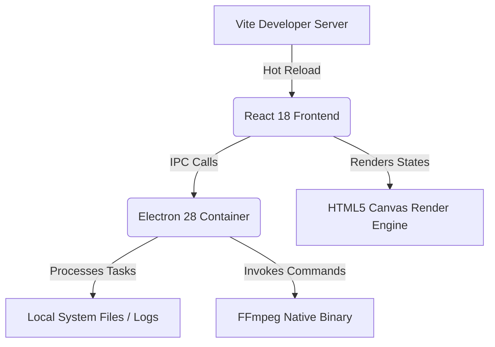

# 🎬 VIBE-BR-Video Editor

> **Automated Multi-Character Dialogue Video Editor** tailored for creating short-form, high-engagement content.

---

## 🌟 Overview

**VIBE-BR-Video Editor** is a professional desktop application designed to streamline the production of multi-character dialogue videos. By combining a multi-track timeline, automated script parsing, and real-time canvas rendering, it automates syncing character visual states (like PNG animations) to multi-voice TTS audio, layered over background gameplay footage.

Ideal for content creators aiming for YouTube Shorts, TikTok, and Instagram Reels, VIBE-BR eliminates the tedious manual editing of standard video tools.

---

## 🚀 Quick Start

### Prerequisites
- **Node.js**: v18 or later (recommended)
- **FFmpeg**: A valid FFmpeg binary is required for export (place it in the local `./bin/` folder or ensure it is in your system's `PATH`).

### Installation
Clone the repository and install dependencies:
```bash
git clone https://github.com/<username>/vibe-br-video-editor.git
cd vibe-br-video-editor
npm install
```

### Running Locally
To launch the application in development mode (spawning both the Vite dev server and the Electron container):
```bash
npm run dev
```

### Packaging & Build
To compile the React bundle and package the desktop app for distribution (using `electron-builder`):
```bash
npm run build
```

---

## 🎨 Core Features

### 📝 Smart Script Parser
- **Pattern Matching**: Paste standard formatted scripts like `**CharacterName:** Dialogue content` to automatically detect characters.
- **Auto-Track Generation**: Spawns dedicated tracks on the timeline for each speaker.
- **Custom Keywords**: Define custom keyword sets to detect new characters on the fly.
- **Silence Sync**: Analyzes audio tracks to line up speech pauses.

### 🖼️ Real-Time Preview Canvas
- **HTML5 Canvas 2D Engine**: High-performance rendering of dynamic media.
- **Free Transform Controls**: Scale, rotate, drag, and layer character sprites directly in the viewer.
- **Micro-Animations**: Built-in visual triggers such as *Pop*, *Slide*, *Fade*, and *Zoom-Spin* that synchronize with speaking actions.
- **Smart Captions**: Automatically wrapped dialogue text overlays with customizable styles.

### ⏱️ Multi-Track Timeline
- **Visual Waveform**: A synchronized audio waveform track to track vocal beats.
- **Independent Character Tracks**: Easily adjust individual duration, animations, and transitions.
- **Precise Playhead Controls**: Zoomable ruler, timeline snapping, and frame-by-frame scrubbing.
- **Drag & Resize**: Intuitive layout adjustments.

### 📤 Multi-Format Exporter
- **FFmpeg Render Pipeline**: Blazing-fast, high-quality rendering.
- **Aspect Ratio Presets**:
  - 📱 TikTok / Shorts (9:16)
  - 📸 Instagram Square (1:1)
  - 🖥️ Standard Landscape (16:9)
- **Advanced Control**: Fine-tune output resolution, framerate (FPS), and bitrates.

---

## 🏗️ Architecture & Tech Stack



### Technologies Used
* **Frontend Framework**: [React 18](https://react.dev/) + [Vite](https://vitejs.dev/) for quick HMR.
* **Desktop Platform**: [Electron 28](https://www.electronjs.org/) for native OS integration and local filesystem access.
* **Graphics**: HTML5 Canvas 2D API for real-time asset layering.
* **Processing**: [FFmpeg](https://ffmpeg.org/) for stitching background tracks, speaking characters, captions, and audio files.

---

## 📁 Project Structure

```
├── electron/           # Electron main process & preload scripts
│   ├── main.js         # Native window management, IPC handlers, app lifecycle
│   └── preload.js      # Context bridge exposing electronAPI to the renderer
├── src/
│   ├── components/     # High-fidelity React UI components
│   │   ├── TitleBar.jsx        # Frameless window controls and brand logo
│   │   ├── Toolbar.jsx         # Selection tool triggers, timeline options
│   │   ├── MediaLibrary.jsx    # Sound effects, backgrounds, and character assets
│   │   ├── PreviewCanvas.jsx   # Interactive canvas rendering controls
│   │   ├── ScriptEditor.jsx    # Text parser input and dialogue blocks
│   │   ├── Timeline.jsx        # Waveform, audio, and visual tracks
│   │   ├── ExportModal.jsx     # Resolution options & progress indicator
│   │   └── ToastContainer.jsx  # Notification alert overlay
│   ├── engine/         # Core logic processors
│   │   ├── scriptParser.js     # Parses scripts using Regex patterns
│   │   ├── animationEngine.js  # Runs mathematical tick-rates for pop/fade/slide
│   │   └── exportEngine.js     # Generates command parameters for FFmpeg
│   ├── store/
│   │   └── ProjectContext.jsx  # Context-based global project state
│   ├── styles/
│   │   └── index.css           # Design tokens, variables, & component styles
│   ├── App.jsx                 # Layout layout grids
│   └── main.jsx                # DOM entry point
├── scripts/
│   └── wait-for-vite.js        # Prevents Electron from loading before Vite starts
├── bin/                        # [Ignored] Folder for FFmpeg binary files
└── package.json                # Project configurations & dependencies
```

---

## 📋 Keyboard Shortcuts

| Shortcut Key | Action |
|:---:|---|
| <kbd>V</kbd> | Selection Tool |
| <kbd>C</kbd> | Cut/Slice Tool |
| <kbd>H</kbd> | Hand/Pan Tool |
| <kbd>Space</kbd> | Play / Pause Preview |
| <kbd>Delete</kbd> | Delete Selected Timeline Clip |

---

## 🛡️ License

This project is licensed under the MIT License - see the LICENSE file for details.
